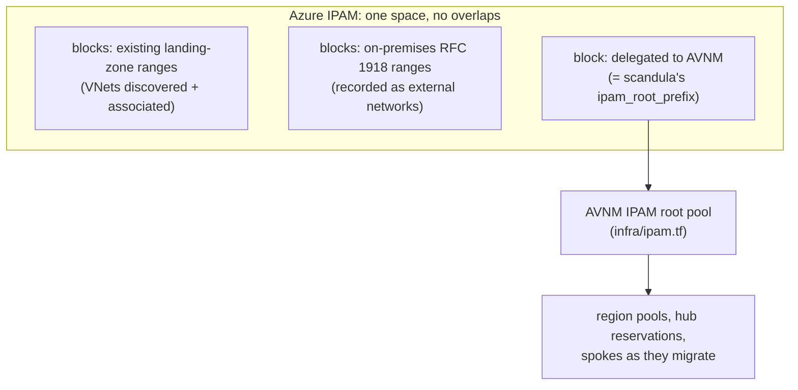

# Plan: Azure IPAM as the address authority, with AVNM taken on piece by piece

**Status: nothing is deployed.** The address model below is decided. Two parts are built: Azure
IPAM's deployment as Terraform ([`azure-ipam/`](../azure-ipam/README.md), decision 4) and layer A's policy
([`infra/policy-onprem.tf`](../infra/policy-onprem.tf)). The inputs and the other decisions
further down are still open.

## Where Aberdeen starts

- An existing **Enterprise-Scale (Azure Landing Zones)** estate, running **without AVNM**. Its
  VNets already use address space.
- Networks move under **AVNM** (this repo) **piece by piece**, not in one cut-over.
- **On-premises uses RFC 1918 ranges.** Azure must never hand those out, and nobody must be
  able to create a VNet on them.

## The model (decided 2026-09-11)

**Azure IPAM** ([`Azure/ipam`](https://github.com/Azure/ipam), Microsoft's open-source tool) is
the **single source of truth for all of Aberdeen's address space**. That covers Azure inside and
outside AVNM, and on-premises. **AVNM IPAM gets one block allocated from it**, and allocates
hubs and spokes inside that block, as `infra/` already does.



Azure IPAM represents this as:

- **One space** for all of Aberdeen's address space. Blocks in a space can't overlap.
- **Blocks for the existing landing-zone ranges.** Azure IPAM discovers those VNets, and an
  administrator associates them with their blocks.
- **Blocks for the on-premises ranges**, holding them as *external networks*. The engine API
  has `/spaces/{space}/blocks/{block}/externals`, with subnets and endpoints under each. This is
  in Azure IPAM's code, but not yet in its how-to guide.
- **One block delegated to AVNM**, which is scandula's `ipam_root_prefix`.

Four rules keep the two IPAMs from disagreeing:

1. **Nobody makes reservations in Azure IPAM inside AVNM's block.** AVNM can't see Azure IPAM's
   reservations, so a reservation there could hand out a range AVNM also allocates.
2. **VNets that AVNM creates are associated with AVNM's block in Azure IPAM**, by hand or through
   its API. Azure IPAM doesn't do it automatically; until then it sees the block as allocated
   but can't see its use.
3. **scandula mirrors the on-premises ranges** in `reserved_prefixes`, so `terraform plan`
   refuses an AVNM root that overlaps them.
4. **AVNM grows by adding blocks and pools, not by editing prefixes.** IPAM pool prefixes are
   ForceNew in Terraform.

## Inputs needed

| Input | From | Used for |
|-------|------|----------|
| **On-premises RFC 1918 ranges** | Aberdeen network team | Azure IPAM external networks, the policy in layer A below, scandula's `reserved_prefixes` |
| **Existing landing-zone VNet ranges** | Azure Resource Graph, from an account that can read the landing zones | Azure IPAM blocks; choosing AVNM's block |
| **The landing-zone management-group hierarchy, and who owns policy there** | Aberdeen platform team | Where the policies are assigned, and by whom |

⚠ **scandula's `ipam_root_prefix` (`10.64.0.0/12`) is a placeholder.** It was chosen before
Aberdeen's address space was known. Nothing gets applied until it's checked against both ranges
lists above.

## Reserved vs blocked

- **Reserved** means *recorded*. Azure IPAM, AVNM static CIDRs and scandula's `reserved_prefixes`
  each stop **their own** allocations from using a range. None of them stops a person from
  creating a VNet on it by hand.
- **Blocked** means *denied by Azure Policy*. That's the only thing that stops anyone, in any
  subscription.

Two policy layers, applied at different times:

### Layer A: on-premises ranges, everywhere, from day one

Assign at the landing-zone root management group, covering existing landing zones and AVNM
alike. It **denies any VNet whose address space overlaps an on-premises range**, in either
direction: a VNet inside an on-premises range, or one that contains it. Subnets always sit
inside their VNet's address space, so blocking VNet prefixes covers subnets too.

**It's code: [`infra/policy-onprem.tf`](../infra/policy-onprem.tf)**, off until
`onprem_policy.management_group_id` is set. It takes its ranges from `reserved_prefixes`, so
the IPAM overlap check and the policy can't disagree, and it starts in **Audit**:

```hcl
reserved_prefixes = ["<on-premises ranges>"]
onprem_policy = {
  management_group_id = "/providers/Microsoft.Management/managementGroups/<landing-zone root>"
  # effect = "Deny"   # only after reviewing what Audit found
}
```

The identity that applies it needs **Resource Policy Contributor** at that management group.

⚠ **The first draft of this rule, in this document, would have blocked every dual-stack
VNet.** `ipRangeContains` fails when its two ranges are different address families, and Azure
Policy treats a failed evaluation as a deny, **even under Audit**. The code only compares
ranges of the same family, inside `if()`, which Azure Policy documents as evaluating only the
branch it picks. The tests pin that guard exactly.

Before switching to Deny, check the Audit results. An existing VNet that already overlaps
on-premises is a real finding to fix, not one to exempt quietly. Under Deny, Azure refuses
any create or update of an overlapping VNet, including updates to one that already exists.

### Layer B: AVNM-only allocation, per migrated scope

This is Microsoft's pattern from "Prevent overlapping virtual network address spaces with Azure
Policy and IPAM": **deny any VNet that doesn't hold an allocation from the designated AVNM IPAM
pools.** Assign it to **each subscription or management group once it has migrated**, and never
at the landing-zone root while VNets outside AVNM still live there. It would deny them all.

## Migration order

1. **Inventory:**
   - Deploy Azure IPAM, which discovers the existing VNets.
   - Enter the on-premises ranges as external networks.
   - Associate the landing-zone VNets with their blocks.
2. **Layer A:** assign it in Audit, review the results, then switch to Deny.
3. **Choose AVNM's block:**
   - Record it in Azure IPAM.
   - Set scandula's `ipam_root_prefix` to it, and `reserved_prefixes` to the on-premises ranges.
   - Run `make plan` with the hubs off, then apply the AVNM control plane.
4. **Per workload or subscription, one at a time:**
   - New VNets allocate from AVNM pools.
   - Existing VNets either get **associated with an AVNM pool**, if their prefix sits inside it,
     or are **re-addressed or rebuilt** inside AVNM's block, if not.
   - Then assign layer B to that scope and connect it to its hub.
5. **Repeat** until the landing zones are fully under AVNM. Azure IPAM keeps the tenant-wide view
   throughout.

## Deploying Azure IPAM

### What it is and what it deploys

A web app (a UI plus an engine API) that discovers VNets, subnets and endpoints using the
engine's Reader role and Azure Resource Graph. It's MIT-licensed and actively committed; the
latest release is **v3.6.0 (2025-09-11)**. It's installed by a PowerShell script
(`deploy/deploy.ps1`) driving Bicep. **There's no Terraform installer.** `examples/ipam-terraform`
only *consumes* its API.

Into its own resource group:

| Resource | Notes |
|----------|-------|
| App Service plan **P1v3** (Linux) + App Service | Runs the IPAM container. P1v3 is **hard-coded**; `-Function` uses Elastic Premium instead. |
| Cosmos DB (SQL API) | Autoscale, max 1000 RU/s |
| Key Vault | Engine client secret, app IDs, tenant ID |
| Log Analytics workspace | Diagnostics |
| User-assigned managed identity | **Contributor** and **Managed Identity Operator** on its resource group (the Bicep sets no scope, so they land there) |

And in the Entra ID tenant:

- An **engine** app registration, given **Reader at the root management group** (`-MgmtGroupId`
  overrides that), and a client secret valid for **2 years**.
- A **UI** app registration (skipped with `-DisableUI`), with Microsoft Graph `User.Read` and
  `Directory.Read.All`, and Azure Service Management `user_impersonation`. These need **admin
  consent**.

### Decision 1: discovery scope

The engine's Reader role has to cover **every landing-zone subscription**, or Azure IPAM can't
see the VNets it's meant to own. That's the tenant root (the default), or the management group
that holds all the landing zones. Microsoft's docs *highly discourage* a non-root group.

### Decision 2: who installs it

`deploy.ps1` needs **Owner** on the subscription, a **role-assignment-capable role at the tenant
root management group**, and **Global Administrator** for admin consent. The deploying account
has none of the last two. So it's a two-part install:

- **Part 1 (identities):** an Aberdeen tenant administrator applies `azure-ipam/entra`. It makes
  our deploying identity an owner of both app registrations.
- **Part 2 (infrastructure):** we apply `azure-ipam/platform`. As an owner, it creates the
  engine's client secret itself and puts it straight into Key Vault.

`deploy.ps1 -AppsOnly` instead writes the secret into `main.parameters.json` for part 2. The
Terraform split means nothing secret is ever handed over.

### Decision 3: cost and subscription

Azure retail prices, East Asia, 2026-09-11:

| Item | Price |
|------|-------|
| App Service P1v3 Linux | about $158/month (Southeast Asia: $134) |
| Cosmos DB autoscale | about $9–88/month |
| Log Analytics, Key Vault | small |

**Roughly $170–250 a month, running all the time.** That needs a paid subscription. On the
Visual Studio credit subscription it would run out in about a week, and the tfstate account
would be disabled with it.

### Decision 4: how this repo runs it (implemented)

**Native Terraform: see [`azure-ipam/`](../azure-ipam/README.md)** (the runbook, two roots, and
the `make ipam-*` targets). It replaced a pinned wrapper around `deploy.ps1` on 2026-09-11, at
the user's request.

- It reproduces what `deploy.ps1` and its Bicep create at v3.6.0, with deliberate, listed
  differences. The main one is that no secret is handed over (decision 2).
- The pin lives in `azure-ipam/platform/release.json`: release, commit, the SHA-256 of
  `ipam.zip`, and Python. Terraform refuses a zip that doesn't match.
- The app runs the zip as a package (`WEBSITE_RUN_FROM_PACKAGE=1`), so its bundled dependencies,
  built from upstream's lock file, are the ones that run. `deploy.ps1 -Native` rebuilds from the
  unpinned `requirements.txt`, and the container install runs `ipam:latest`.
- Part 2 is off until `ipam_enabled = true`, and refuses credit subscriptions.

The cost of this choice: upgrades mean diffing upstream's `deploy/` between releases and
carrying any change across by hand, instead of running Microsoft's updated script.

### Operating it

- The engine secret lasts two years. The first part 2 apply after one year replaces it, so run
  an apply at least once a year.
- Upgrade by updating `azure-ipam/platform/release.json` in a PR, after diffing upstream's
  `deploy/` between the releases (the runbook has the commands). Never run upstream's
  `update.ps1`: without `-ZipFilePath` it downloads `releases/latest`.
- Teardown means part 2 **and** part 1. The app registrations are tenant objects and outlive the
  resource group.

## Open questions

- **The on-premises RFC 1918 ranges,** and **the existing landing-zone VNet ranges** (see Inputs
  needed).
- **Who owns Azure Policy** at the landing-zone root, to assign layer A and later layer B?
- **Who in Aberdeen runs part 1** (Global Administrator plus the root management group), and
  will they approve `Directory.Read.All`?
- **Discovery at the tenant root,** or the landing-zone management group?
- **UI, or API only** (`-DisableUI`, which skips the `Directory.Read.All` consent)?
- **Which paid subscription?**
