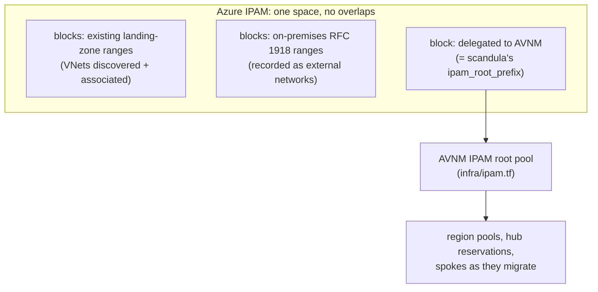

# Plan: Azure IPAM as the address authority, with AVNM taken on piece by piece

**Status: plan only.** Nothing here is deployed or coded yet. The address model below is
decided; the inputs and the remaining decisions further down aren't.

## Where Aberdeen starts

- An existing **Enterprise-Scale (Azure Landing Zones)** estate, running **without AVNM**. Its
  VNets already use address space.
- Networks move under **AVNM** (this repo) **piece by piece**, not in one cut-over.
- **On-premises uses RFC 1918 ranges.** Azure must never hand those out, and nobody must be
  able to create a VNet on them.

## The model (decided 2026-09-11)

**Azure IPAM** ([`Azure/ipam`](https://github.com/Azure/ipam), Microsoft's open-source tool) is
the **single source of truth for all of Aberdeen's address space**. That covers Azure inside and
outside AVNM, and on-premises. **AVNM IPAM gets one block allocated from it**, and allocates
hubs and spokes inside that block, as `infra/` already does.



Azure IPAM represents this as:

- **One space** for all of Aberdeen's address space. Blocks in a space can't overlap.
- **Blocks for the existing landing-zone ranges.** Azure IPAM discovers those VNets, and an
  administrator associates them with their blocks.
- **Blocks for the on-premises ranges**, holding them as *external networks*. The engine API
  has `/spaces/{space}/blocks/{block}/externals`, with subnets and endpoints under each. This is
  in Azure IPAM's code, but not yet in its how-to guide.
- **One block delegated to AVNM**, which is scandula's `ipam_root_prefix`.

Four rules keep the two IPAMs from disagreeing:

1. **Nobody makes reservations in Azure IPAM inside AVNM's block.** AVNM can't see Azure IPAM's
   reservations, so a reservation there could hand out a range AVNM also allocates.
2. **VNets that AVNM creates are associated with AVNM's block in Azure IPAM**, by hand or through
   its API. Azure IPAM doesn't do it automatically; until then it sees the block as allocated
   but can't see its use.
3. **scandula mirrors the on-premises ranges** in `reserved_prefixes`, so `terraform plan`
   refuses an AVNM root that overlaps them.
4. **AVNM grows by adding blocks and pools, not by editing prefixes.** IPAM pool prefixes are
   ForceNew in Terraform.

## Inputs needed

| Input | From | Used for |
|-------|------|----------|
| **On-premises RFC 1918 ranges** | Aberdeen network team | Azure IPAM external networks, the policy in layer A below, scandula's `reserved_prefixes` |
| **Existing landing-zone VNet ranges** | Azure Resource Graph, from an account that can read the landing zones | Azure IPAM blocks; choosing AVNM's block |
| **The landing-zone management-group hierarchy, and who owns policy there** | Aberdeen platform team | Where the policies are assigned, and by whom |

⚠ **scandula's `ipam_root_prefix` (`10.64.0.0/12`) is a placeholder.** It was chosen before
Aberdeen's address space was known. Nothing gets applied until it's checked against both ranges
lists above.

## Reserved vs blocked

- **Reserved** means *recorded*. Azure IPAM, AVNM static CIDRs and scandula's `reserved_prefixes`
  each stop **their own** allocations from using a range. None of them stops a person from
  creating a VNet on it by hand.
- **Blocked** means *denied by Azure Policy*. That's the only thing that stops anyone, in any
  subscription.

Two policy layers, applied at different times:

### Layer A: on-premises ranges, everywhere, from day one

Assign at the landing-zone root management group, covering existing landing zones and AVNM
alike. It **denies any VNet whose address space overlaps an on-premises range**, in either
direction: a VNet inside an on-premises range, or one that contains it. Subnets always sit
inside their VNet's address space, so blocking VNet prefixes covers subnets too.

Starting point, built on Azure Policy's documented `ipRangeContains(range, targetRange)`. Test
it in **Audit** first, then switch to **Deny**:

```json
{
  "mode": "All",
  "parameters": {
    "onPremRanges": { "type": "Array", "metadata": { "displayName": "On-premises RFC 1918 ranges" } },
    "effect": { "type": "String", "allowedValues": ["Audit", "Deny"], "defaultValue": "Audit" }
  },
  "policyRule": {
    "if": {
      "allOf": [
        { "field": "type", "equals": "Microsoft.Network/virtualNetworks" },
        {
          "count": {
            "field": "Microsoft.Network/virtualNetworks/addressSpace.addressPrefixes[*]",
            "where": {
              "count": {
                "value": "[parameters('onPremRanges')]",
                "name": "onPrem",
                "where": {
                  "anyOf": [
                    { "value": "[ipRangeContains(current('onPrem'), current('Microsoft.Network/virtualNetworks/addressSpace.addressPrefixes[*]'))]", "equals": true },
                    { "value": "[ipRangeContains(current('Microsoft.Network/virtualNetworks/addressSpace.addressPrefixes[*]'), current('onPrem'))]", "equals": true }
                  ]
                }
              },
              "greater": 0
            }
          },
          "greater": 0
        }
      ]
    },
    "then": { "effect": "[parameters('effect')]" }
  }
}
```

Before switching to Deny, check the Audit results. An existing VNet that already overlaps
on-premises is a real finding to fix, not one to exempt quietly.

### Layer B: AVNM-only allocation, per migrated scope

This is Microsoft's pattern from "Prevent overlapping virtual network address spaces with Azure
Policy and IPAM": **deny any VNet that doesn't hold an allocation from the designated AVNM IPAM
pools.** Assign it to **each subscription or management group once it has migrated**, and never
at the landing-zone root while VNets outside AVNM still live there. It would deny them all.

## Migration order

1. **Inventory:**
   - Deploy Azure IPAM, which discovers the existing VNets.
   - Enter the on-premises ranges as external networks.
   - Associate the landing-zone VNets with their blocks.
2. **Layer A:** assign it in Audit, review the results, then switch to Deny.
3. **Choose AVNM's block:**
   - Record it in Azure IPAM.
   - Set scandula's `ipam_root_prefix` to it, and `reserved_prefixes` to the on-premises ranges.
   - Run `make plan` with the hubs off, then apply the AVNM control plane.
4. **Per workload or subscription, one at a time:**
   - New VNets allocate from AVNM pools.
   - Existing VNets either get **associated with an AVNM pool**, if their prefix sits inside it,
     or are **re-addressed or rebuilt** inside AVNM's block, if not.
   - Then assign layer B to that scope and connect it to its hub.
5. **Repeat** until the landing zones are fully under AVNM. Azure IPAM keeps the tenant-wide view
   throughout.

## Deploying Azure IPAM

### What it is and what it deploys

A web app (a UI plus an engine API) that discovers VNets, subnets and endpoints using the
engine's Reader role and Azure Resource Graph. It's MIT-licensed and actively committed; the
latest release is **v3.6.0 (2025-09-11)**. It's installed by a PowerShell script
(`deploy/deploy.ps1`) driving Bicep. **There's no Terraform installer.** `examples/ipam-terraform`
only *consumes* its API.

Into its own resource group:

| Resource | Notes |
|----------|-------|
| App Service plan **P1v3** (Linux) + App Service | Runs the IPAM container. P1v3 is **hard-coded**; `-Function` uses Elastic Premium instead. |
| Cosmos DB (SQL API) | Autoscale, max 1000 RU/s |
| Key Vault | Engine client secret, app IDs, tenant ID |
| Log Analytics workspace | Diagnostics |
| User-assigned managed identity | **Contributor** and **Managed Identity Operator** on the subscription |

And in the Entra ID tenant:

- An **engine** app registration, given **Reader at the root management group** (`-MgmtGroupId`
  overrides that), and a client secret valid for **2 years**.
- A **UI** app registration (skipped with `-DisableUI`), with Microsoft Graph `User.Read` and
  `Directory.Read.All`, and Azure Service Management `user_impersonation`. These need **admin
  consent**.

### Decision 1: discovery scope

The engine's Reader role has to cover **every landing-zone subscription**, or Azure IPAM can't
see the VNets it's meant to own. That's the tenant root (the default), or the management group
that holds all the landing zones. Microsoft's docs *highly discourage* a non-root group.

### Decision 2: who installs it

`deploy.ps1` needs **Owner** on the subscription, a **role-assignment-capable role at the tenant
root management group**, and **Global Administrator** for admin consent. The deploying account
has none of the last two. So it's a two-part install:

- **Part 1 (identities):** an Aberdeen tenant administrator runs `deploy.ps1 -AppsOnly`. It
  writes `main.parameters.json`.
- **Part 2 (infrastructure):** we run `deploy.ps1 -ParameterFile main.parameters.json`.

⚠ `main.parameters.json` carries the engine's client secret. Hand it over securely and never
commit it.

### Decision 3: cost and subscription

Azure retail prices, East Asia, 2026-09-11:

| Item | Price |
|------|-------|
| App Service P1v3 Linux | about $158/month (Southeast Asia: $134) |
| Cosmos DB autoscale | about $9–88/month |
| Log Analytics, Key Vault | small |

**Roughly $170–250 a month, running all the time.** That needs a paid subscription. On the
Visual Studio credit subscription it would run out in about a week, and the tfstate account
would be disabled with it.

### Decision 4: how this repo runs it

**Recommended: the upstream script, pinned** to `v3.6.0`. An `azure-ipam/` folder would hold a
runbook and Makefile targets with the non-secret options (`-Location eastasia`, `-NamePrefix`,
`-Tags`). That's Microsoft's supported path, and `update.ps1` upgrades work. It's outside
Terraform state. The alternatives are a Terraform wrapper around the compiled ARM
(`azurerm_resource_group_template_deployment` + `azuread`), or a native rewrite. Both are more
work, and both drift from upstream.

### Operating it

- Rotate the engine secret before its 2-year expiry. Put that in the runbook, because nothing
  reminds you.
- Upgrade with `update.ps1`.
- Teardown means the resource group **and** both app registrations. The app registrations are
  tenant objects and outlive the resource group.

## Open questions

- **The on-premises RFC 1918 ranges,** and **the existing landing-zone VNet ranges** (see Inputs
  needed).
- **Who owns Azure Policy** at the landing-zone root, to assign layer A and later layer B?
- **Who in Aberdeen runs part 1** (Global Administrator plus the root management group), and
  will they approve `Directory.Read.All`?
- **Discovery at the tenant root,** or the landing-zone management group?
- **UI, or API only** (`-DisableUI`, which skips the `Directory.Read.All` consent)?
- **Which paid subscription?**
