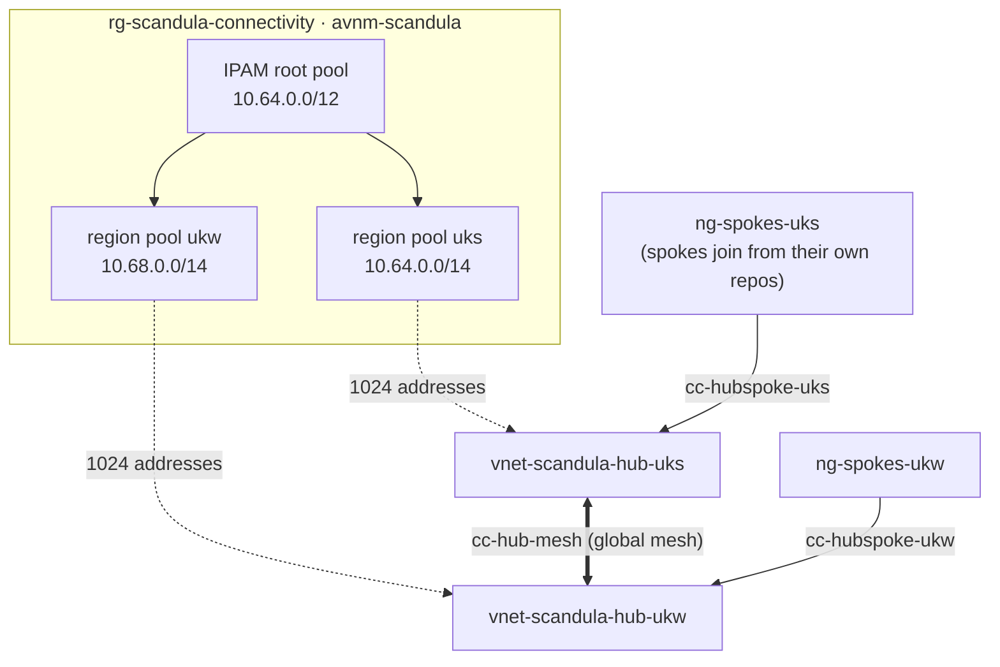

# Design

## Topology

- **IPAM owns the address plan.** No VNet or subnet here has a hardcoded prefix. A hub
  asks its region pool for `hub_ip_count` addresses and IPAM picks a free block; the hub
  subnets do the same. Spokes, in whichever repo owns them, allocate from the same
  region pool (the `ipam_region_pool_ids` output), so nothing can overlap by accident.
- **Hub-and-spoke per region.** Spokes peer with their region's hub only, with
  `group_connectivity = "None"`: spoke-to-spoke traffic goes through the hub, and in
  time through its firewall.
- **Hubs are meshed** (`cc-hub-mesh`, global mesh) once there are two or more regions,
  so cross-region traffic goes hub to hub.
- **Deployments are per region** and list every configuration committed in that
  region. Nothing is live until deployed.

## Address plan

| Block | Use |
|-------|-----|
| `10.64.0.0/12` | IPAM root: all Azure space (10.64.0.0 – 10.79.255.255) |
| `10.64.0.0/14` | `uks` region pool: its hub (a /22 by default) and uksouth spokes |
| `10.68.0.0/14` | `ukw` region pool: its hub and ukwest spokes |
| `10.72.0.0/14` | unallocated, for a third region |
| `10.76.0.0/14` | unallocated. The end of it (e.g. `10.79.255.0/24`) is a good `root_static_cidrs` home for a P2S client pool |

Why `10.64.0.0/12`: it stays clear of the homelab LAN (`10.1.0.0/23`, enforced by
`reserved_prefixes`), of Azure's own `10.0.0.0/16` default, and of the Kubernetes
default pod and service ranges (`10.244.0.0/16`, `10.96.0.0/12`). All of those are
things a site-to-site VPN might one day have to route around.

A /14 per region is 262,144 addresses, which is plenty. It's still a /14 rather than a
/16 because growing a pool means replacing it (prefixes are ForceNew), and starting big
is cheaper than migrating.

## Not here yet (deliberately)

Each is a follow-up PR, not something this scaffold pretends to have:

- **Azure Firewall** in each hub, plus an AVNM **routing configuration** (add `Routing`
  to `scope_accesses`) to send spoke traffic through it.
- **VPN / ExpressRoute gateway**, and then `use_hub_gateway = true` for that region. A
  site-to-site tunnel to the homelab is the obvious first use.
- **Bastion** (the subnet exists; the host doesn't).
- **Security admin rules** (`SecurityAdmin`): estate-wide deny rules that spoke NSGs
  can't override.
- **DNS Private Resolver** in the hub, for private endpoints and conditional forwarding
  to `*.mocridhe.co.uk`.
- **Spokes.** They live in their workload repos and join via `ng-spokes-<region>`.
- **A plan job in CI** over OIDC (see docs/bootstrap.md).
