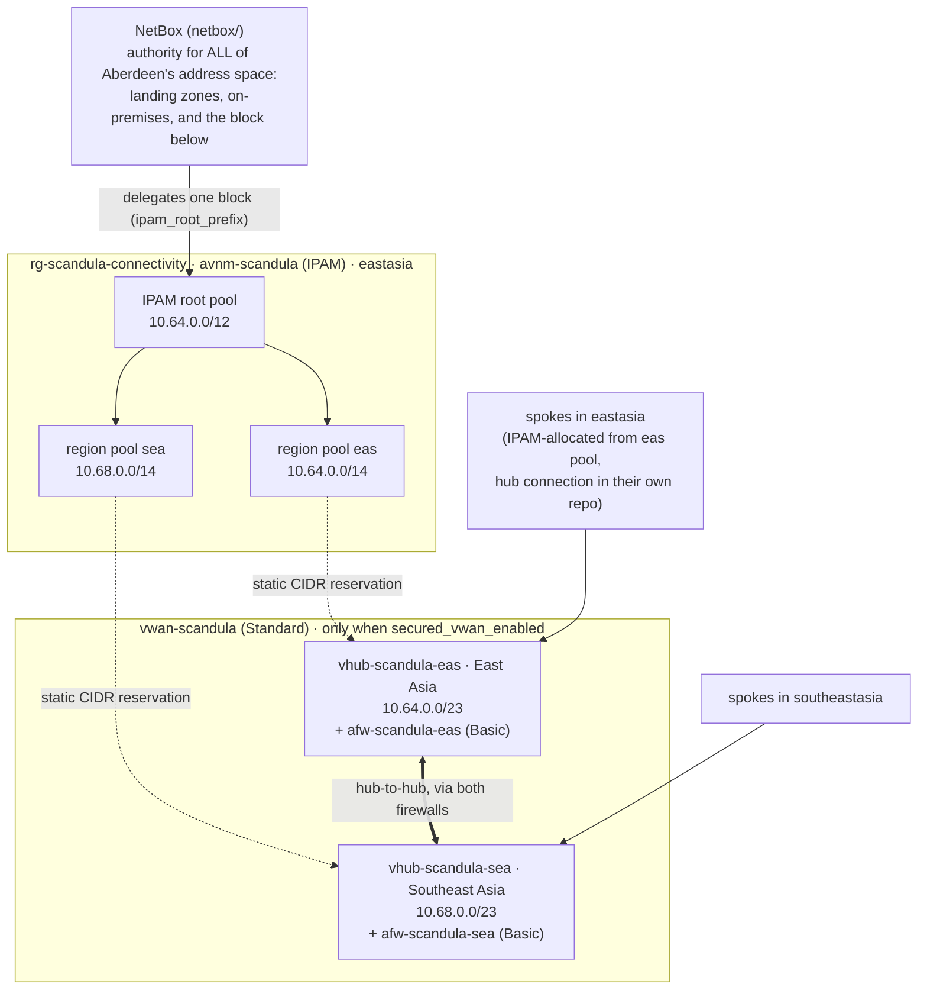

# Design

## Topology



- **AVNM IPAM owns this repo's block, not the whole plan.** NetBox is the authority for
  all of Aberdeen's address space and delegates one block here, `ipam_root_prefix`
  ([netbox-plan.md](netbox-plan.md)). Inside it, spokes allocate from their region's
  pool (the `ipam_region_pool_ids` output). A vWAN hub isn't a VNet, so its range is written
  explicitly and **reserved** as a static CIDR on the region pool. The reservation
  exists even while the hubs are off, so the plan doesn't change shape when they're
  switched on.
- **Virtual WAN does the connectivity.** It's Standard, because Basic is site-to-site VPN
  only. Standard vWAN meshes its hubs itself, and spokes attach with
  `azurerm_virtual_hub_connection` to the `virtual_hubs[*].id` output.
- **Every hub is secured.** An Azure Firewall (`AZFW_Hub`) sits in each hub, and
  **routing intent** sends both internet and private traffic through it. With private
  routing intent on both hubs, spoke-to-spoke and hub-to-hub traffic cross the
  firewalls. The shared policy `afwp-scandula` carries one baseline rule collection
  group (see Firewall rules below); anything it doesn't allow is denied.
- **Why not AVNM for connectivity any more:** a vWAN hub can't be in an AVNM network
  group. An AVNM hub-and-spoke config with a vWAN hub as the hub is preview, and it
  needs a vWAN *connection policy* that azurerm 5.4 can't set.

## Firewall rules

`infra/firewall-rules.tf` allows **nothing by default**. Everything the hub firewall
permits is named, one entry at a time, in `terraform.tfvars` (the target in
[zero-trust.md](zero-trust.md)):

| Variable | Becomes | Refuses |
|----------|---------|---------|
| `east_west_flows` | one network rule per approved flow, in `allow-named-flows` (1100) | `"Any"` protocol, `"*"` ports, anything outside `ipam_root_prefix` |
| `egress_https_fqdns` | `https-allowlist`, HTTPS 443 to those destinations | a bare `*` |
| `egress_http_fqdns` | `http-revocation`, HTTP 80, for CRL and OCSP only | a bare `*` |
| `egress_fqdn_tags` | `microsoft-fqdn-tags`, Microsoft-maintained destination sets | names that aren't tags |

```hcl
east_west_flows = {
  app1-to-sql = {
    description  = "app1 (eas) to the SQL MI (sea). Asked for by the app1 team, 2026-09-14."
    sources      = ["10.64.1.0/24"]
    destinations = ["10.68.2.0/24"]
    protocols    = ["TCP"]
    ports        = ["1433"]
  }
}
egress_https_fqdns = ["login.microsoftonline.com", "*.ubuntu.com"]
egress_fqdn_tags   = ["WindowsUpdate"]
```

The rule collection group `rcg-baseline` (priority 1000) is only created when something
is named: Azure rejects an empty group, and "no rules" is the right state until a
workload asks for one. Everything unnamed is denied, which is Azure Firewall's default,
and there is no inbound DNAT.

⚠ **Until 2026-09-14 this was a blanket pair**: any protocol and port between anything
IPAM handed out, plus 80/443 to any FQDN. Both widened by themselves as IPAM allocated.
They were replaced after the question "is opening 80/443 across the spokes wise in zero
trust?". It wasn't.

Egress rules are *application* rules because Firewall Basic filters FQDNs only at the
application level (SNI for HTTPS). Network-level FQDN rules need the firewall's DNS
proxy, which Basic doesn't have, and Basic can't inspect what it allows at all: see
[zero-trust.md](zero-trust.md) for what the tiers cost.

## Firewall logs

`infra/diagnostics.tf` sends both hub firewalls to one Log Analytics workspace,
`log-<prefix>-hub`, as **`allLogs` into the dedicated `AZFW*` tables** plus metrics.
Without it, nothing the rules allow or refuse can be checked.

It is built with the hubs and can be turned off with `firewall_diagnostics_enabled`.
The workspace is free; ingestion and `log_retention_days` (30 by default) are not.

## Cost

Azure retail prices (USD, `prices.azure.com`, checked 2026-09-10):

| Item | Price |
|------|-------|
| Standard hub | $0.25 / hour |
| Azure Firewall **Basic**, secured virtual hub | $0.395 / hour |
| Hub data processed | $0.02 / GB |
| Firewall Basic data processed | $0.065 / GB |
| Extra routing infrastructure unit, if the hub router scales up | $0.10 / hour |

**Per secured hub: $0.645/h, about $470/month. Two hubs: about $942/month**, before
data. That's the same in every commercial region, East and Southeast Asia included;
only the US Government regions cost more. Firewall Standard would take two hubs to about
$2,190/month.

That is why **`secured_vwan_enabled` defaults to false**. The bootstrap subscription is
a Visual Studio credit subscription ($50/month, spending limit on). Two hubs would use
it up in about 39 hours, and Azure would then disable the subscription, including the
tfstate storage account.

Firewall Basic's limits: up to **250 Mbps**, and **no DNS proxy**, so a hub can't be the
DNS forwarder for its spokes. Use a DNS Private Resolver for that when it's needed.

## Address plan

| Block | Use |
|-------|-----|
| `10.64.0.0/12` | IPAM root: all Azure space (10.64.0.0 – 10.79.255.255) |
| `10.64.0.0/14` | `eas` region pool (East Asia): its hub reservation and eastasia spokes |
| `10.64.0.0/23` | `eas` vWAN hub (reserved static CIDR) |
| `10.68.0.0/14` | `sea` region pool (Southeast Asia): its hub reservation and southeastasia spokes |
| `10.68.0.0/23` | `sea` vWAN hub (reserved static CIDR) |
| `10.72.0.0/14` | unallocated, for a third region |
| `10.76.0.0/14` | unallocated. The end of it (e.g. `10.79.255.0/24`) is a good `root_static_cidrs` home for a P2S client pool |

A hub gets a /23 because Azure recommends it (the minimum is /24), and it sits at the
start of its region pool so the rest of the /14 is one contiguous block for spokes.

Why `10.64.0.0/12`: it stays clear of Azure's own `10.0.0.0/16` default and of the
Kubernetes default pod and service ranges (`10.244.0.0/16`, `10.96.0.0/12`). Before
anything on-premises is connected, put its ranges in `reserved_prefixes` (empty by
default); a validation then keeps the root clear of them. That only keeps *this repo's*
allocations clear. To stop anyone creating a VNet on those ranges, `onprem_policy` assigns
an Azure Policy at a management group (`infra/policy-onprem.tf`, off by default; see
[layer A](azure-ipam-plan.md#layer-a-on-premises-ranges-everywhere-from-day-one)). Once a
scope has migrated, `avnm_allocation_policy` requires its VNets to allocate from the region
pools (`infra/policy-avnm.tf`, [layer B](azure-ipam-plan.md#layer-b-avnm-only-allocation-per-migrated-scope)).

## Regions

**East Asia (`eas`) + Southeast Asia (`sea`)**, chosen 2026-09-10 to avoid capacity
contention. They're an Azure region pair, and both have availability zones. The control
plane (`location`) is in East Asia too. The tfstate account stays in UK South, where
bootstrap put it; storage there works fine.

Price didn't decide it: a secured hub costs the same in every commercial region.
Contention did. The best read-only signal is how many VM sizes Azure marks
`NotAvailableForSubscription` for the Visual Studio subscription. Azure Firewall runs on
managed compute, so compute access is a fair proxy, though not proof.

| Region | VM sizes blocked for this subscription | AZs |
|--------|----------------------------------------|-----|
| UK South | **all: it lists 0 sizes** | yes |
| UK West | **all: it lists 0 sizes** | no |
| East Asia | 27 of 802 (zone-level only) | yes |
| Korea Central | 138 of 758 | yes |
| Japan East | 514 of 1012 | yes |
| Southeast Asia | 592 of 1024 | yes |

Network quotas (public IPs, VNets) were identical in every region checked, so the
difference is compute access, not networking. Southeast Asia is the more restricted of
the pair. If a hub or firewall ever fails to deploy there with a capacity error, Korea
Central is the next least restricted.

## Not here yet (deliberately)

Each is a follow-up PR, not something this pretends to have:

- **VPN / ExpressRoute gateway in a hub**, for on-premises connectivity. Set
  `reserved_prefixes` to the on-prem ranges first.
- **DNS Private Resolver**, for private endpoints and conditional forwarding to
  on-premises DNS. Firewall Basic can't proxy DNS.
- **Spokes.** They live in their workload repos, not here. The pattern to copy is
  [`examples/spoke`](../examples/spoke): the VNet and its subnets allocate from the region
  pool (`ip_address_pool`, so no CIDR is ever written down), each subnet gets an NSG that
  denies what it doesn't name, and `azurerm_virtual_hub_connection` attaches it to the
  region's hub.
- **A plan job in CI** over OIDC (see docs/bootstrap.md).
