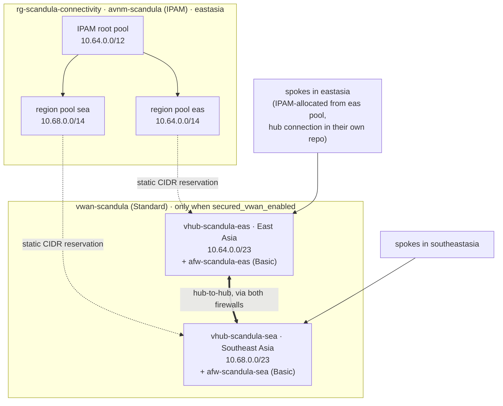

# Design

## Topology

- **IPAM owns the address plan.** Spokes allocate from their region's pool (the
  `ipam_region_pool_ids` output). A vWAN hub isn't a VNet, so its range is written
  explicitly and **reserved** as a static CIDR on the region pool. The reservation
  exists even while the hubs are off, so the plan doesn't change shape when they're
  switched on.
- **Virtual WAN does the connectivity.** It's Standard, because Basic is site-to-site VPN
  only. Standard vWAN meshes its hubs itself, and spokes attach with
  `azurerm_virtual_hub_connection` to the `virtual_hubs[*].id` output.
- **Every hub is secured.** An Azure Firewall (`AZFW_Hub`) sits in each hub, and
  **routing intent** sends both internet and private traffic through it. With private
  routing intent on both hubs, spoke-to-spoke and hub-to-hub traffic cross the
  firewalls. The shared policy `afwp-scandula` has no rules yet, and Azure Firewall
  denies by default, so nothing crosses a hub until rule collection groups are added.
- **Why not AVNM for connectivity any more:** a vWAN hub can't be in an AVNM network
  group. An AVNM hub-and-spoke config with a vWAN hub as the hub is preview, and it
  needs a vWAN *connection policy* that azurerm 5.4 can't set.

## Cost

Azure retail prices (USD, `prices.azure.com`, checked 2026-09-10):

| Item | Price |
|------|-------|
| Standard hub | $0.25 / hour |
| Azure Firewall **Basic**, secured virtual hub | $0.395 / hour |
| Hub data processed | $0.02 / GB |
| Firewall Basic data processed | $0.065 / GB |
| Extra routing infrastructure unit, if the hub router scales up | $0.10 / hour |

**Per secured hub: $0.645/h, about $470/month. Two hubs: about $942/month**, before
data. That's the same in every commercial region, East and Southeast Asia included;
only the US Government regions cost more. Firewall Standard would take two hubs to about
$2,190/month.

That is why **`secured_vwan_enabled` defaults to false**. The bootstrap subscription is
a Visual Studio credit subscription ($50/month, spending limit on). Two hubs would use
it up in about 39 hours, and Azure would then disable the subscription, including the
tfstate storage account.

Firewall Basic's limits: up to **250 Mbps**, and **no DNS proxy**, so a hub can't be the
DNS forwarder for its spokes. Use a DNS Private Resolver for that when it's needed.

## Address plan

| Block | Use |
|-------|-----|
| `10.64.0.0/12` | IPAM root: all Azure space (10.64.0.0 – 10.79.255.255) |
| `10.64.0.0/14` | `eas` region pool (East Asia): its hub reservation and eastasia spokes |
| `10.64.0.0/23` | `eas` vWAN hub (reserved static CIDR) |
| `10.68.0.0/14` | `sea` region pool (Southeast Asia): its hub reservation and southeastasia spokes |
| `10.68.0.0/23` | `sea` vWAN hub (reserved static CIDR) |
| `10.72.0.0/14` | unallocated, for a third region |
| `10.76.0.0/14` | unallocated. The end of it (e.g. `10.79.255.0/24`) is a good `root_static_cidrs` home for a P2S client pool |

A hub gets a /23 because Azure recommends it (the minimum is /24), and it sits at the
start of its region pool so the rest of the /14 is one contiguous block for spokes.

Why `10.64.0.0/12`: it stays clear of the homelab LAN (`10.1.0.0/23`, enforced by
`reserved_prefixes`), of Azure's own `10.0.0.0/16` default, and of the Kubernetes
default pod and service ranges (`10.244.0.0/16`, `10.96.0.0/12`). All of those are
things a site-to-site VPN might one day have to route around.

## Regions

**East Asia (`eas`) + Southeast Asia (`sea`)**, chosen 2026-09-10 to avoid capacity
contention. They're an Azure region pair, and both have availability zones. The control
plane (`location`) is in East Asia too. The tfstate account stays in UK South, where
bootstrap put it; storage there works fine.

Price didn't decide it: a secured hub costs the same in every commercial region.
Contention did. The best read-only signal is how many VM sizes Azure marks
`NotAvailableForSubscription` for the Visual Studio subscription. Azure Firewall runs on
managed compute, so compute access is a fair proxy, though not proof.

| Region | VM sizes blocked for this subscription | AZs |
|--------|----------------------------------------|-----|
| UK South | **all: it lists 0 sizes** | yes |
| UK West | **all: it lists 0 sizes** | no |
| East Asia | 27 of 802 (zone-level only) | yes |
| Korea Central | 138 of 758 | yes |
| Japan East | 514 of 1012 | yes |
| Southeast Asia | 592 of 1024 | yes |

Network quotas (public IPs, VNets) were identical in every region checked, so the
difference is compute access, not networking. Southeast Asia is the more restricted of
the pair. If a hub or firewall ever fails to deploy there with a capacity error, Korea
Central is the next least restricted.

## Not here yet (deliberately)

Each is a follow-up PR, not something this pretends to have:

- **Firewall rules.** The policy is empty, so everything crossing a hub is denied.
- **Firewall diagnostics** to a Log Analytics workspace (that has its own cost).
- **VPN gateway in a hub**, for a site-to-site tunnel to the homelab. From Asia that's
  a long round trip to the UK.
- **DNS Private Resolver**, for private endpoints and conditional forwarding to
  `*.mocridhe.co.uk`. Firewall Basic can't proxy DNS.
- **Spokes.** They live in their workload repos: allocate from the region pool, attach
  with `azurerm_virtual_hub_connection`.
- **A plan job in CI** over OIDC (see docs/bootstrap.md).
