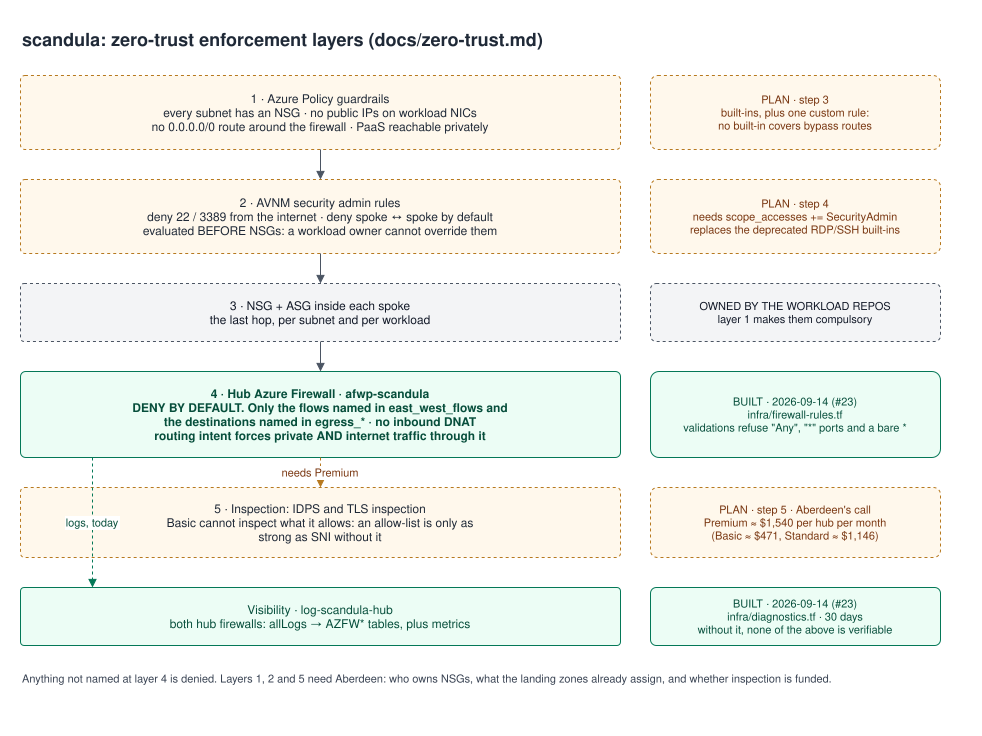

# Plan: zero trust for Aberdeen's Azure network

**Status: steps 1 and 2 are built; the rest is plan.** It answers one question asked on
2026-09-14: is the firewall baseline compatible with zero trust? It wasn't, and this is
what replaced it.

| Step | State |
|------|-------|
| 1. Visibility (D5) | **built** for the firewalls: `infra/diagnostics.tf` sends both hubs to one workspace, `allLogs` into the dedicated `AZFW*` tables. NSG flow logs are not |
| 2. Tighten the baseline (D1 east-west, D2 egress) | **built**: `infra/firewall-rules.tf` allows nothing unless it's named. The blanket rules are gone |
| 3. Guardrail policies (D4) | plan |
| 4. AVNM security admin rules (D1) | plan |
| 5. Tier (D3), Bastion (D6), private endpoints and DNS (D7) | plan; needs Aberdeen |

## Where we were

Until 2026-09-14, `infra/firewall-rules.tf` put two rules on the shared hub policy:

| Rule | Allows | Problem |
|------|--------|---------|
| `allow-spoke-to-spoke` (network) | **any protocol, any port**, `ipam_root_prefix` → `ipam_root_prefix`, across both hubs | every workload can reach every other workload, in any region, on any port. One compromised host reaches the estate |
| `allow-outbound-web` (application) | HTTP 80 + HTTPS 443 from every spoke to **any FQDN** | open exfiltration and command-and-control path. On Basic there is no inspection behind it |

Both follow `ipam_root_prefix`, so the permission **widens automatically** as IPAM hands out
new ranges. Routing intent steers traffic through the firewall, and the firewall then allows
nearly all of it: traffic is *seen*, not *controlled*. And with no diagnostics yet, it isn't
even seen.

What already helped: no inbound DNAT; private **and** internet traffic forced through the hub
firewall; on the control plane, OIDC with no stored secrets, an identity per Azure IPAM part,
split state, Key Vault RBAC, and Cosmos DB key auth off.

**Both rules are now gone.** Each flow and each destination is named in `east_west_flows`,
`egress_https_fqdns`, `egress_http_fqdns` and `egress_fqdn_tags`; validations refuse `"Any"`
protocols, `"*"` ports and a bare `*` FQDN; and the rule collection group isn't created at all
while nothing is named. The firewalls' logs go to `log-<prefix>-hub`. What's below still
stands for steps 3 to 5.

## What zero trust means here

| Principle | What it demands of this network | Today |
|-----------|--------------------------------|-------|
| Verify explicitly | Every flow is allowed by name (source, destination, port, FQDN), not by prefix | ✗ east-west is a prefix pair, egress is `*` |
| Least privilege | A workload reaches only what it was granted | ✗ everything reaches everything |
| Assume breach | Segmentation contains a compromise; traffic is inspected and logged | ✗ no segmentation, no IDPS, no logs |

## The target

Source: [`diagrams/zero-trust.drawio`](diagrams/zero-trust.drawio), re-exported with `make diagram`.

Five numbered layers, each catching what the one before it can't, plus one place to look when
something is refused. Layer 4 and the logging are built; layers 1, 2 and 5 are not.

## Decisions to take

### D1. East-west: default deny

- **Delete `allow-spoke-to-spoke`.** No blanket rule at any prefix.
- Each approved flow becomes its own rule collection group: IP Groups for source and
  destination, specific ports, a comment naming who asked and why.
- Migration needs a temporary allow? Scope it to **named spoke prefixes**, never the root,
  with an expiry date written into the code.
- **Add AVNM security admin rules** as the tenant baseline. They are evaluated before NSGs, so
  a workload owner cannot open a port by editing their own NSG. Typical baseline: deny inbound
  22 and 3389 from Internet, deny inbound from Internet except to approved ports, deny
  spoke-to-spoke by default.
  - Needs `scope_accesses` to include `SecurityAdmin` (it's `["Connectivity"]` today), plus
    network groups, a security admin configuration, rule collections, rules, and a deployment.
    All exist in azurerm 5.x: `azurerm_network_manager_network_group`,
    `azurerm_network_manager_security_admin_configuration`,
    `azurerm_network_manager_admin_rule_collection`, `azurerm_network_manager_admin_rule`,
    `azurerm_network_manager_deployment`.
  - ⚠ This is also the answer to a gap in Azure Policy: the built-ins **"RDP access from the
    Internet should be blocked"** (`e372f825-…`) and **"SSH access from the Internet should be
    blocked"** (`2c89a2e5-…`) are **deprecated**. Security admin rules replace them.

### D2. Egress: an allow-list, not `*`

- Allow **443 to named FQDNs** plus Microsoft's FQDN tags for platform traffic
  (Windows Update, Azure Backup, and so on).
- Keep **80 only for certificate revocation** (CRL and OCSP endpoints), named explicitly.
- Each workload adds its destinations in its own rule collection group, which doubles as the
  audit trail of who asked for what.
- Without inspection an allow-list is only as strong as SNI, which leads to D3.

### D3. Firewall tier

Azure retail prices, East Asia, checked 2026-09-14 via `prices.azure.com`. Monthly figures
are 730 hours and **include the Standard hub itself** ($0.25/h). Standard and Premium bill a
deployment rate **plus capacity units that scale with throughput**, so these are floors, and
the minimum capacity-unit count still needs confirming.

| Tier | Deployment | Capacity unit | Data | Per secured hub | What you get |
|------|-----------|---------------|------|-----------------|--------------|
| **Basic** | $0.395/h | — | $0.065/GB | **~$471/mo** | FQDN filtering by SNI only. No IDPS, no TLS inspection, no web categories, no DNS proxy, 250 Mbps |
| **Standard** | $1.25/h | $0.07/h | $0.016/GB | **~$1,146/mo** | Threat intelligence, web categories, DNS proxy |
| **Premium** | $1.75/h | $0.11/h | $0.016/GB | **~$1,540/mo** | IDPS and TLS inspection: you can inspect what you allow |

Two hubs: about **$942** (Basic), **$2,292** (Standard), **$3,081** (Premium) a month, before
data. Note data processing is cheaper above Basic ($0.016 vs $0.065/GB), so at volume the gap
narrows.

**Recommendation:** zero trust implies inspecting allowed traffic, which is Premium. Basic
cannot do it at all. This is a cost decision for Aberdeen, not a technical one.

### D4. Guardrail policies (layer C)

Built on layers A and B, same shape: off by default, **Audit first**, assigned per scope. Ids
verified in the tenant on 2026-09-14.

| Guardrail | Built-in | Id |
|-----------|----------|-----|
| Every subnet has an NSG | Subnets should be associated with a Network Security Group | `e71308d3-144b-4262-b144-efdc3cc90517` |
| No public IPs on workload NICs | Network interfaces should not have public IPs | `83a86a26-fd1f-447c-b59d-e51f44264114` |
| No IP forwarding | Network interfaces should disable IP forwarding | `88c0b9da-ce96-4b03-9635-f29a937e2900` |
| VMs sit behind an NSG | Internet-facing / non-internet-facing VMs should be protected with NSGs | `f6de0be7-…`, `bb91dfba-…` |
| PaaS is private | Storage `b2982f36-…`, Key Vault `405c5871-…`, Cosmos DB `797b37f7-…`, App Service `1b5ef780-…` | per service |

- **No built-in covers "no route table may send `0.0.0.0/0` straight to Internet"**, which is
  how a spoke bypasses the hub firewall. That needs a custom definition, written like layers A
  and B.
- For the PaaS set, consider adopting a built-in initiative instead of a hand-picked list:
  **Microsoft cloud security benchmark** (`1f3afdf9-d0c9-4c3d-847f-89da613e70a8`, or v2
  `e3ec7e09-…`) or **CIS Azure Foundations v2.0.0** (`06f19060-…`). First check what the
  landing zones already assign, so we don't duplicate or contradict it.

### D5. Visibility, before anything else

Nothing above is verifiable today. Firewall diagnostics to Log Analytics is the first change,
then NSG flow logs with traffic analytics. AVNM also ships a reachability analyser
(`azurerm_network_manager_verifier_workspace`) that can prove a flow is blocked, which is
worth using when we tighten the rules. Log Analytics ingestion is the running cost.

### D6. Administrative access

If there's no sanctioned path, people create public IPs. Azure Bastion in the hub (or per
spoke), no public IPs on VMs, and just-in-time access. Security admin rules deny 22 and 3389
from Internet so it can't be undone locally.

### D7. Private endpoints and DNS

Private endpoints for PaaS need private DNS, and Firewall Basic has no DNS proxy, so a **DNS
Private Resolver** in the hub is a prerequisite (`docs/design.md` already lists it as missing).
This also applies to **Azure IPAM's own platform**: today its App Service, Key Vault and Cosmos
DB are reachable over public endpoints. Making them private is a deliberate deviation from
upstream and would need VNet integration.

### D8. Identity plane

Already good: OIDC without stored secrets, an identity per part, split state, digest-gated
applies, Key Vault RBAC, Cosmos key auth off. Remaining:

- The **entra CI identity holds Graph `Directory.ReadWrite.All`**, which is near
  Global Administrator. Put it behind PIM, or make part 1 a rare human-run task.
- **Conditional Access** for the Azure IPAM UI app (MFA, compliant device), or run it
  API-only (`ui_enabled = false`), which also drops the `Directory.Read.All` consent.

## Order of work

1. **Diagnostics** (D5). Without logs nothing else can be verified.
2. **Tighten the baseline** (D1 east-west, D2 egress). Code change in this repo, with tests.
3. **Guardrail policies** (D4) in Audit, then Deny per scope.
4. **AVNM security admin rules** (D1). Needs `SecurityAdmin` scope and network groups.
5. **Tier** (D3), **Bastion** (D6), **private endpoints and DNS** (D7). Cost and design.

Steps 1–3 are contained in this repo. Steps 4–5 reach the whole estate and need Aberdeen's
agreement.

## What it costs

| Item | Cost |
|------|------|
| Firewall tier change | Basic → Standard: about **+$675/mo per hub**. Basic → Premium: about **+$1,069/mo per hub** |
| Firewall + flow logs in Log Analytics | ingestion, by volume: needs an estimate from real traffic |
| AVNM security admin rules | the retail price API returned **no meter** for Virtual Network Manager in East Asia on 2026-09-14. Check Microsoft's pricing page before enabling: don't assume free |
| Bastion, DNS Private Resolver, private endpoints | each has its own hourly cost; not priced here |
| Policies (layers A, B, C) | free |

## Open questions

- **Does Aberdeen want inspection** (Premium), or accept an uninspected allow-list (Basic)?
- **Do workloads actually need spoke-to-spoke at all?** If most don't, default-deny is cheap
  to adopt now, while the estate is empty.
- **What do the landing zones already assign** (MCSB, CIS, custom)? Layer C must not fight it.
- **Who owns NSGs** in the workload repos, and will they accept security admin rules above them?
- **Is there a Bastion or JIT standard** already, and a DNS design for private endpoints?
- **IPv6:** any dual-stack VNets? It changes both the firewall rules and layer A's guard.

## Inputs needed

| Input | From | For |
|-------|------|-----|
| The egress FQDNs each workload needs | workload owners | D2's allow-list |
| The flows between workloads that must exist | workload owners | D1's named rules |
| Existing policy assignments at the landing-zone root | Aberdeen platform team | D4 |
| Expected firewall throughput | Aberdeen | D3's capacity units, and the real bill |
